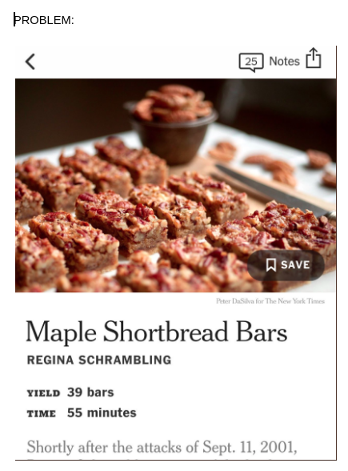
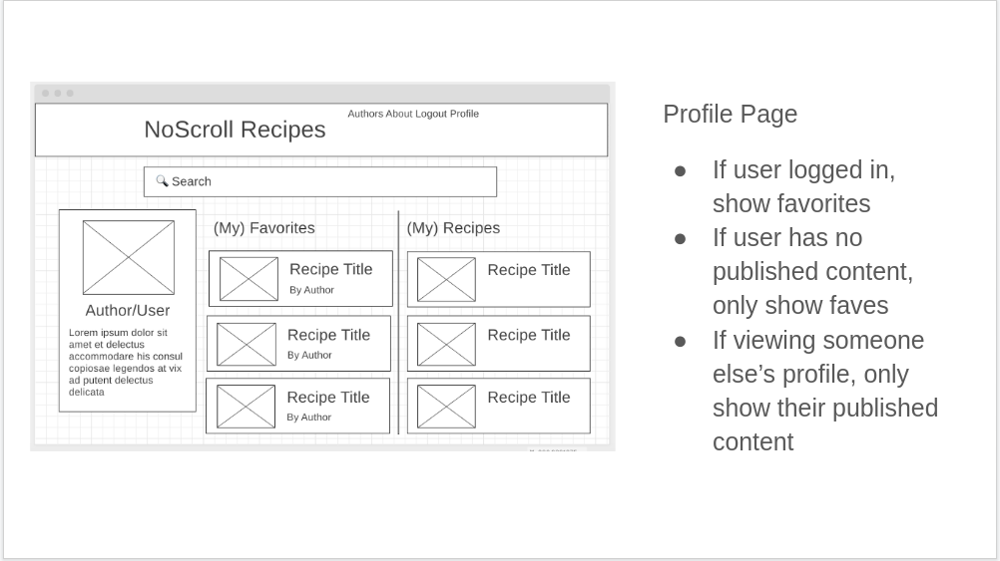
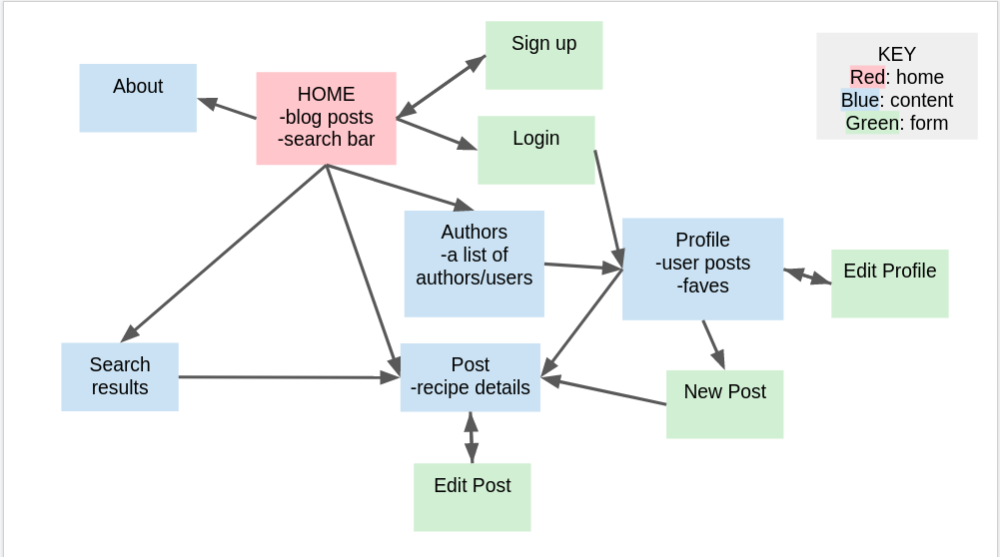
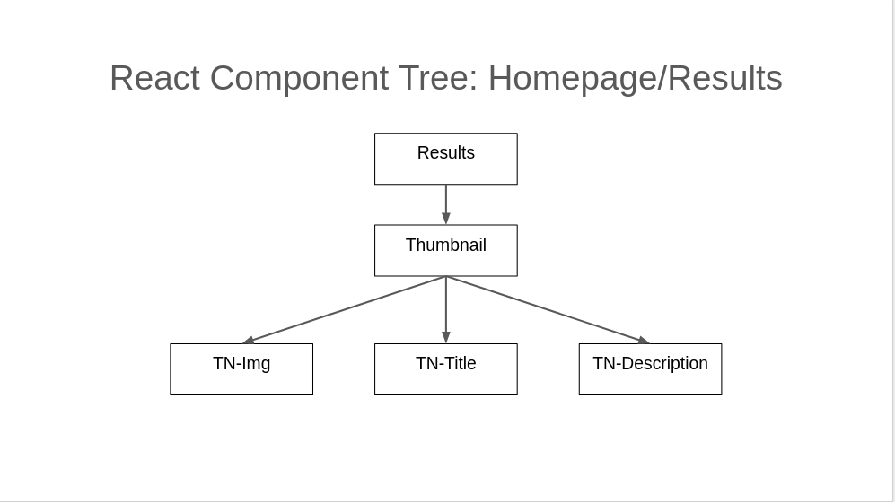
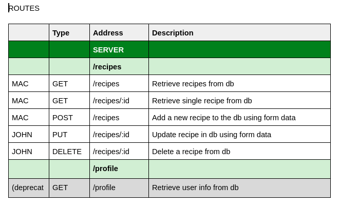
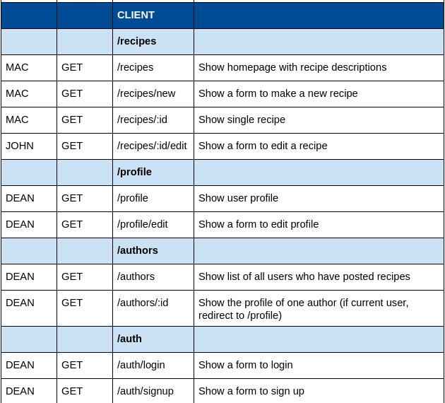
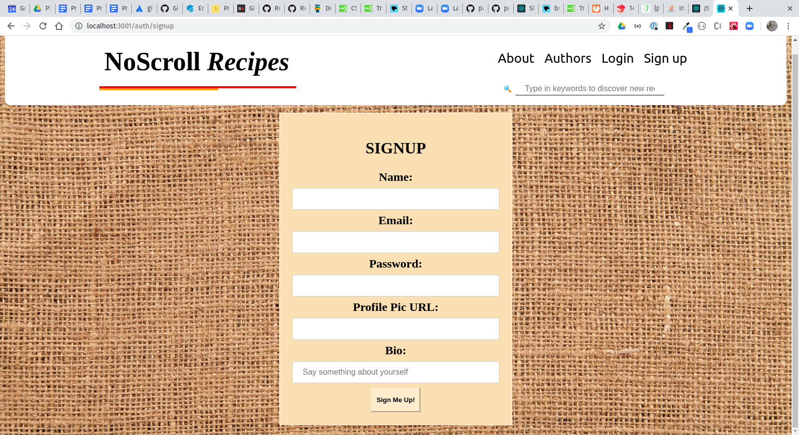

# recipe-app-project3

Micro Blogging MERN Application for Recipes

------------------------------

Group Project for SEI 29 Seattle Unit 3

------------------------------------------

# User Stories 

* “As a user, I want to find recipes that are easy to navigate to make cooking a less stressful experience and grow my culinary skills.”

*  “As a content creator, I want a place to post recipes where my readers can trust that my content will be accessible.”

## Installation Instructions

Fork and/or clone repository.
Run ```npm install``` in both server and client folders to install dependencies.

## Technologies Used

* MongoDB
* Express.js
* React
* Node.js


# Project Evolution

### 1st Day - Thursday, March 13

Project began on day of team selection announcements. Last day of in campus instruction prior to moving to remote classes. Spent the day on decoupled app code-along, a functional team planning workshop - as well as installing Zoom for the upcoming remote classes. Our team began discussing ideas and making plans for the coming week.

### 2nd and 3rd Days - Saturday and Sunday, March 14th & March 15th

We made a final decision on idea - a No Scroll Recipe App that would allow users to see an entire recipe without scrolling. Users would able to save recipes and favorite recipes, share recipes, etc. Dean showed the team some initial wireframes.





Our team met on Zoom twice during these initial days. On Sunday we drew user flow charts and made additional wire frames incorporating various design ideas.

Team decided on some initial user stories. Made some initial user flow charts.



### 4th Day - Monday March 16th

Project was pitched to instructors and approved to go forward. Model files with schemas and initial server side routes were planned. React Component Tree created.



Team began coding within the structure of a MERN application.

### 5th Day - Tuesday March 17th

Continued coding routes and structure for MongoDB schemas. Began testing routes using Postman and a basic seeder file.



### 6th Day - Wednesday March 18th

Began working on client side routes in React. 



### 7th Day - Thursday March 19

Completed authentication files. Continued work on React functionality. More testing of React routes on client side.

### 8th Day - Friday March 20th

Continued work on React components. 

### 9th and 10th Day - Saturday and Sunday March 21st and 22nd

Began CSS stying styling and worked on debugging and adding functionality.



### 11th Day - Monday March 23rd

Worked with instructors on continued debugging.

## Unsolved Problems / Major Hurdles

* We will need to continue to debug for various edge cases
* We want to continue to add features
* Learning the gitflow and learning React were the major hurdles to overcome for this project


## STRETCH GOALS

* Allow users to add comments to recipes
* Use cloudinary API - allow users to upload profile photos, recipe photos
* Use twitter API/ OAuth - allow users to post recipe descriptions to twitter


## AKNOWLEDGEMENTS

* Our great instructors, Sarah King and Anna Zocher.
* Our terrific and generous helpers, Sean and Nick.
* Our super-cool classmates from SEI 29 General Assembly - Seattle


